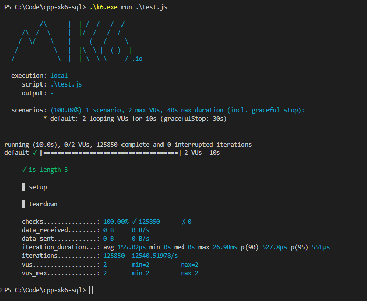

# cpp-xk6-sql 
POC of using xk6-sql with CPP.

Repo: https://github.com/grafana/xk6-sql
Blog: https://k6.io/blog/load-testing-sql-databases-with-k6/

## Build binary
Binary is build using xk6-cmd with the change to the build command to include xk6-sql, command assumes you are working from the xk6-cmd repo/project
```
xk6 build --with xk6-cmd=. --with github.com/grafana/xk6-sql
```

## MS SQL Server
This extension uses go modules and those repos contain more information that can be helpful.
- https://github.com/denisenkom/go-mssqldb

### Connection setup
If get an error like the following on local db connection: 
```
Unable to open tcp connection with host 'localhost:1433': dial tcp 127.0.0.1:1433: connectex: No connection could be made because the target machine actively refused it.
```
Need to complete the following steps to enable TCP/IP connections:
1. Open Sql Server Configuration Manger
2. Expand `SQL Server Network Configuration` and select `Protocols for MSSQSLSERVER`
3. Set TCP/IP to `Enabled`
4. Restart computer

Reference: https://stackoverflow.com/questions/32010749/go-with-sql-server-driver-is-unable-to-connect-successfully-login-fail

- Use the connection string like the following to use Windows Authentication:
```
'const connectionString = sqlserver://COMPUTER-NAME:1433?database=Test&trusted+connection=yes'
```

#### Connection to remote server
It is possible to connect to a remote Dev LMS server using your RHU (colo) account. If you are using the extension from a test controller instance you are already logged in with RHU and the connection string can be:
```
const connectionString = 'sqlserver://IP-ADDRESS:1433?database=Test&trusted+connection=yes'
```
Where the `IP-ADDRESS` is the ip of the database instance. It looks like there is IP blocking on the database instance and this sort of connection only works from within AWS instances (included IP addresses)

### Example of results
After running the `test.js` script with `2` VUs for a duration of `10s` against a local db.

- Can read this as the the database/query is able to support 2 Vus with an average duration of 155.02µs per transaction
- Or 12540.51978 queries per second with an average time of 155.02µs
- Min `0s` most likely means that the queries were too quick for the timer in k6
- Med `0s` most likely means that a major of queries were too quick for the timer in k6
